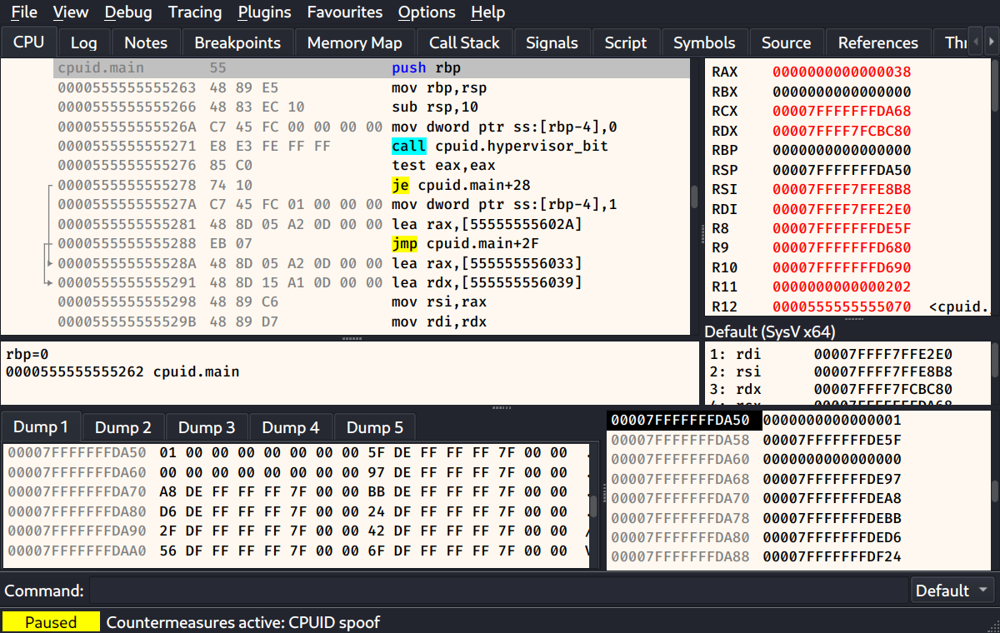

# cutegdb

一个用 Rust 编写、仿照 [x64dbg](https://x64dbg.com/) 的 **GDB** 图形前端。它保留了
x64dbg 的界面布局、快捷键与操作逻辑，底层通过 GDB/MI 驱动，因此 GDB 能调试的目标它都能
调试；此外还内置了面向恶意软件分析人员的**反反调试与反反虚拟机**对抗功能。

📖 [English](README.md) · [使用文档](docs/usage.zh-CN.md)（[English](docs/usage.md)）

---



## 功能特性

- **x64dbg 风格的 CPU 视图** —— 联动的反汇编、寄存器、栈与内存转储，信息框、跳转箭头，
  以及寄存器变化高亮。
- **熟悉的操作** —— x64dbg 的默认快捷键（F9 运行、F7/F8 单步、Ctrl+F9 执行到返回、
  F2 断点、Ctrl+G 跳转……）与操作逻辑。
- **完整的调试能力** —— 软件/硬件断点、观察点（watchpoint）、条件断点与日志断点、调用栈、
  线程、内存映射、信号、符号、句柄。
- **补丁与标注** —— 内联汇编、字节编辑、补丁管理器，以及保存在按二进制文件区分的数据库中的
  注释、标签与书签。
- **搜索与分析** —— 模式（支持通配符）与字符串搜索、交叉引用、字符串引用。
- **跟踪、图与脚本** —— 带中断条件的指令跟踪、控制流图（G）、x64dbg 风格的脚本解释器，
  以及通过 GDB 内嵌解释器运行的 Python。
- **广泛的目标支持** —— x86-64 与 x86 ELF、ARM/AArch64，以及经由 `gdbserver`/QEMU 的
  远程目标。
- **双模式命令栏** —— 输入 x64dbg 命令（翻译为 GDB）或原始 GDB 命令；下拉框可切换到
  Python 单行执行。
- **反反调试 / 反反虚拟机插件** —— 见下文。

## 反反调试与反反虚拟机

恶意软件常常拒绝在调试器下或虚拟机中运行。cutegdb 内置了对抗功能，让目标看起来运行在一台
普通、未被监视的机器上。它们由 **Plugins（插件）** 菜单控制，会跨会话记忆，并在每次进程
启动或附加时自动重新应用。

| 插件 | 类别 | 对抗的检测 |
|---|---|---|
| **ptrace guard** | 反调试 | `PTRACE_TRACEME`/`ATTACH` 检测与调试寄存器读取 |
| **procfs & environment cloak** | 反调试 | `/proc` 中的 TracerPid、父进程名、调试器环境变量 |
| **timing normalizer** ⚠ | 反调试 | `rdtsc`/`rdtscp` 与时钟系统调用的时间差检测 |
| **software-breakpoint cloak** ⚠ | 反调试 | 通过 `/proc/self/mem` 扫描 `0xCC` 的自校验 |
| **CPUID spoof** | 反虚拟机 | hypervisor 标志位、hypervisor 厂商与品牌字符串 |
| **VM file & device cloak** | 反虚拟机 | DMI、`/proc/cpuinfo`、网卡 MAC、虚拟机设备节点 |
| **VM syscall cloak** | 反虚拟机 | `uname`、主机名与上报的内存大小 |

⚠ = 尽力而为：会在日志中记录哪些能完全隐藏、哪些不能（例如单步带来的时间开销，或直接由 CPU
读取构造的校验和）。

覆盖每种技术的可运行示例程序位于 [`examples/`](examples/)，它们同时也是集成测试用例。下图中，
`anti-vm/cpuid` 示例在启用 **CPUID spoof** 后运行——该插件清除了 hypervisor 标志，每一项检测
都报告为 `clean`：


## 环境要求

- Rust（edition 2024）与 Cargo
- 带 Python 3 的 GDB（`gdb --interpreter=mi3`）
- Qt 6 基础开发文件与 `qmake6`
- C 编译器（`gcc`/`cc`），用于构建目标与示例
- 可选：`gcc-i686-linux-gnu`、`gcc-aarch64-linux-gnu`、`gdbserver`、`qemu-user`
  用于 32 位 / ARM / 远程目标

Debian/Kali：

```sh
sudo apt install build-essential gdb qt6-base-dev libclang-dev
# 可选的交叉/远程支持：
sudo apt install gcc-i686-linux-gnu gcc-aarch64-linux-gnu gdbserver qemu-user
```

## 构建与运行

```sh
cargo build --release
cargo run --release -- /路径/目标程序             # 打开一个程序
cargo run --release -- --smoke-test out.png prog  # 无界面截图（offscreen）
```

`cargo build` 会通过 `cxx-qt-build` 自行编译精简的 C++ Qt Widgets 层，无需单独的 CMake
步骤。若 `qmake6` 不在 `PATH` 中，请在 `.cargo/config.toml` 的 `QMAKE` 指向它。

## 快速上手：击败一次检测

```sh
cd examples && make                 # 构建示例程序
cargo run --release -- examples/build/anti-vm/cpuid
```

在窗口中：**Plugins → Anti-anti-VM → CPUID spoof**（或 *Enable all*），然后按 **F9**。
日志中该程序的输出会从 `DETECTED` 变为 `clean`。

## 测试

```sh
cargo test -p cutegdb-mi -p cutegdb-core -p cutegdb-cmd   # 单元 + 集成测试
cargo clippy --workspace --all-targets                    # lint
QT_QPA_PLATFORM=offscreen cargo run -- --smoke-test /tmp/s.png examples/build/anti-vm/cpuid
scripts/x11-test.sh                                        # 真实 GUI 工作流（X11）
```

反虚拟机测试假定宿主本身是虚拟机来宾；在裸机上会自动跳过（并打印提示）。

## 项目结构

```
crates/
  mi/      GDB/MI3 协议客户端（异步，tokio）
  core/    调试引擎：状态、内存、符号、反汇编、插件
  cmd/     x64dbg 命令与表达式翻译、脚本解释器
  app/     通过 cxx-qt 驱动的 Qt Widgets 界面
examples/  反调试 / 反虚拟机示例程序（并用作测试）
scripts/   GUI 测试驱动与辅助脚本
tests/     通用调试测试夹具
docs/      使用文档（英文 / 中文）
```

## 使用范围

cutegdb 是一款调试与分析工具。请仅对你有权分析的软件使用它及其反反调试 / 反反虚拟机插件
——恶意软件分析、安全研究、CTF 以及你自己的程序。

## 许可证

以 [MIT 许可证](LICENSE) 发布。cutegdb 以独立进程方式运行 GDB，并动态链接 Qt；这些组件
各自保留其许可证（分别为 GPLv3 与 LGPLv3）。
