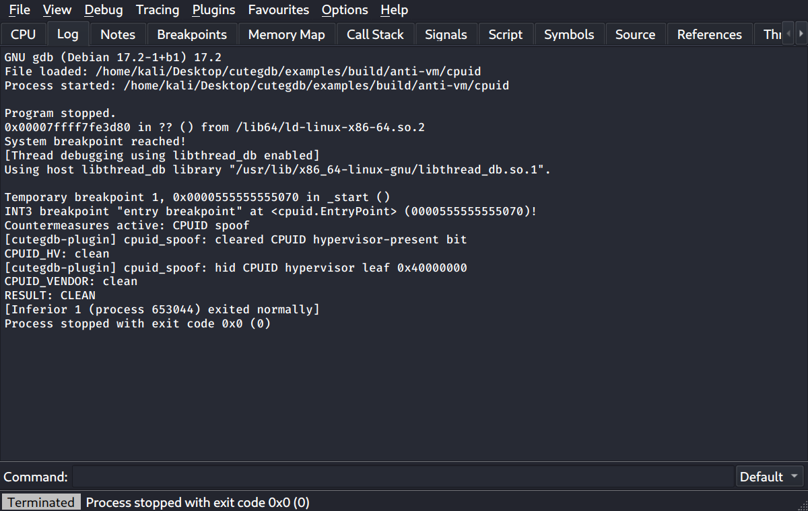

# cutegdb usage guide

[中文版本](usage.zh-CN.md) · [← README](../README.md)

This guide covers day-to-day use: the window, keyboard shortcuts, the command
bar, scripting, and the anti-anti-debug / anti-anti-VM plugins.

## 1. Opening a target

- **File → Open** (or a path argument on the command line) loads and starts a
  program. Execution stops at the *system breakpoint* (the loader's first
  instruction), exactly like x64dbg.
- **File → Attach** (Alt+A) attaches to a running process.
- **File → Connect to remote target** debugs over `gdbserver` or a QEMU gdb stub.

From the system breakpoint, **F9** runs to the *entry breakpoint* (the program's
entry point) and then to your breakpoints.

## 2. The CPU view

The default tab mirrors x64dbg: disassembly (top-left), registers (top-right),
an info box and arguments panel, memory dumps and the stack (bottom). Jump arrows
are drawn in the disassembly, changed registers are highlighted, and the info box
explains the selected instruction.

## 3. Keyboard shortcuts

cutegdb uses x64dbg's default keybindings. The most common:

| Key | Action |
|---|---|
| F9 | Run / continue |
| F7 | Step into |
| F8 | Step over |
| Ctrl+F9 | Execute till return |
| F2 | Toggle breakpoint |
| F4 | Run to selection |
| Ctrl+G | Go to expression |
| G | Function graph of the selection |
| X | Find references to the selected address |
| Ctrl+B | Find pattern (bytes, with `?` wildcards) |
| Space | Assemble at the selected instruction |
| ; | Set a comment |
| : | Set a label |
| Ctrl+P | Patch manager |
| Alt+B / Alt+K / Alt+M | Breakpoints / Call stack / Memory map |

The full table is defined in `crates/app/ui/shortcuts.cpp`.

## 4. The command bar

The bar at the bottom accepts three kinds of input; the dropdown on the right
chooses **Default** or **Python**.

- **x64dbg commands**, translated to GDB — e.g. `bp add`, `bph counter,w,4`,
  `rax=1234`, `g` (go), `t`/`p` (step), `ticnd`/`tocnd` (conditional trace).
- **Raw GDB** — anything GDB understands passes straight through (`info
  registers`, `-data-evaluate-expression …`, etc.).
- **Python** — with the dropdown set to Python, the line runs in GDB's embedded
  interpreter (`print(gdb.selected_frame().pc())`).

Expressions accept registers, symbols, `module.symbol`, hex/dec numbers and
`[addr]` memory dereferences.

## 5. Scripting

The **Script** tab runs x64dbg-style scripts: one command per line, `label:`
definitions, `cmp` with conditional jumps (`je`/`jne`/`jl`/…), `call`/`ret`, and
`pause`. Controls follow x64dbg: **Ctrl+O** open, **Ctrl+L** load the edited text,
**Ctrl+R** reload, **Ctrl+U** unload to edit, **Space** run, **Tab** step,
**Esc** abort. The running line is highlighted.

For heavier automation, use Python from the command bar or GDB's `source`.

## 6. Trace & graph

- **Tracing → Trace into / over** (or `ticnd`/`tocnd`) records executed
  instructions until a break condition holds or the step limit is reached. The
  **Trace** tab lists each instruction with the registers it changed, and can
  export the trace.
- **G** in the disassembly builds the **Graph** of the current function: basic
  blocks with taken (green), not-taken (red) and unconditional (blue) edges.
  Ctrl+wheel zooms; double-click follows a block in the disassembly.

## 7. Anti-anti-debug & anti-anti-VM plugins

### Using them

Open the **Plugins** menu. Countermeasures are grouped into **Anti-anti-debug**
and **Anti-anti-VM**, each a checkable item (hover for a description; *Enable
all* / *Disable all* are at the bottom of each submenu). Your selection is saved
and re-applied automatically whenever a new process reaches its entry point or
you attach — so enable what you want once and forget it. Toggling while the
target is paused applies immediately.

**Plugins → Plugin status…** shows the active countermeasures and how many checks
each has neutralized so far.

### How they work

Each plugin injects a small GDB Python module that installs silent breakpoints —
they patch the debuggee's view of the world and resume without ever surfacing a
stop, so they never interfere with your own breakpoints or stepping. Activity is
written to the Log (`[cutegdb-plugin] …`):



### The plugins

| Plugin | Neutralizes | Notes |
|---|---|---|
| **ptrace guard** | `ptrace(PTRACE_TRACEME/ATTACH)` returning failure under a debugger; `PTRACE_PEEKUSER` reads of the debug registers | hooks the libc `ptrace` wrapper |
| **procfs & environment cloak** | `/proc/*/status` TracerPid, tracing state, a debugger parent's name; `getenv` of `LD_PRELOAD` etc. | rewrites `read()` results |
| **timing normalizer** | `rdtsc`/`rdtscp` and `clock_gettime`/`gettimeofday` deltas used to detect single-stepping | **best-effort**: virtualizes time, so the target no longer sees real time; very large single-step delays elsewhere still cost wall-clock time |
| **software-breakpoint cloak** | self-checksums that read the program's own code through `/proc/self/mem` and look for `0xCC` | **best-effort**: restores original bytes on such reads; checksums built from direct CPU reads cannot be intercepted — prefer hardware breakpoints there |
| **CPUID spoof** | the hypervisor-present bit (leaf 1), hypervisor vendor leaf (`0x40000000`) and brand string | x86/x86-64 only |
| **VM file & device cloak** | DMI vendor/product strings, the `/proc/cpuinfo` hypervisor flag, VM NIC MAC OUIs, and VM device nodes (`/dev/vboxguest`, `/dev/vmci`, …) | makes VM files read as bare metal and VM devices look absent |
| **VM syscall cloak** | `uname`, the hostname (e.g. an analysis box named `kali`) and the reported memory size | normalizes to an ordinary workstation |

### Limitations

- Hooks target the libc wrappers, so a statically linked target issuing raw
  `syscall`/`cpuid` before its entry point can bypass them.
- Fork children are not followed by default, so checks run from a child process
  are not covered.
- The two best-effort plugins are marked ⚠ in the menu and log what they could
  not fully hide.

## 8. Examples

[`examples/`](../examples/) contains one small program per technique. Build and
run them:

```sh
cd examples && make
./build/anti-vm/cpuid            # prints DETECTED lines on a VM
```

Then open the same binary in cutegdb, enable the matching plugin, and press F9 —
the Log shows the checks turning `clean`. See [`examples/README.md`](../examples/README.md)
for the full table.

## 9. Testing

```sh
cargo test -p cutegdb-mi -p cutegdb-core -p cutegdb-cmd   # unit + integration (needs gdb, gcc)
cargo clippy --workspace --all-targets
```

- **Headless smoke test**: `QT_QPA_PLATFORM=offscreen cargo run -- --smoke-test out.png <prog>`
  opens the program, runs to the entry breakpoint and screenshots the CPU tab.
- **Live GUI test**: `scripts/x11-test.sh` drives a real window through the whole
  workflow (including enabling a plugin) on an X11 display, saving screenshots
  under `target/x11-test/`. It sends keys via `scripts/xkey.py` (XTEST) and skips
  itself if the screen is locked.

The anti-VM integration tests only assert detection→clean when the host is a
hypervisor guest; on bare metal they skip with a message.

- **Screenshots**: `scripts/screenshots.sh` regenerates the images in this guide
  by driving cutegdb on the `anti-vm/cpuid` example with the plugin enabled.
